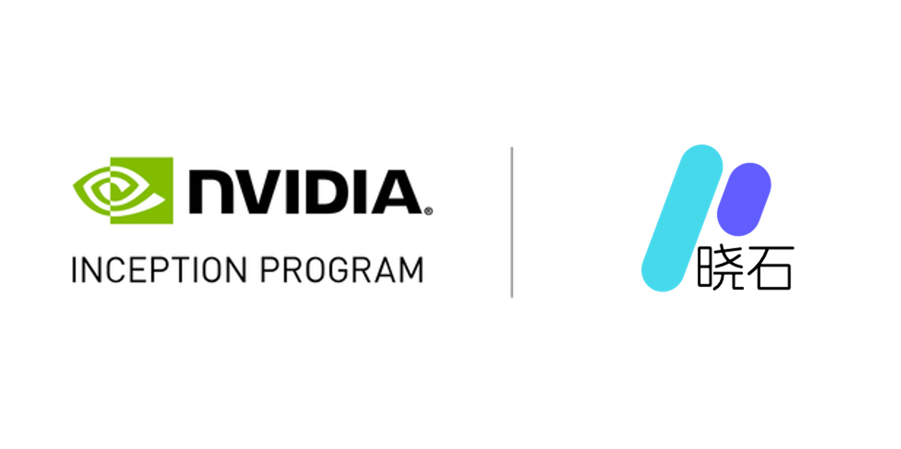

## 新闻通告

**成都，2024 年 11 月 1 日** —— 成都破晓石科技有限公司（以下简称“破晓石”）宣布正式加入 **NVIDIA 初创加速计划（NVIDIA Inception）**。作为 NVIDIA 面向全球创新型科技企业的免费会员制加速项目，NVIDIA Inception 旨在通过技术支持、培训资源、市场推广以及融资与生态对接等方式，帮助创业公司加速产品研发与业务增长。

破晓石长期聚焦云原生与 AI 智算基础设施，围绕容器云、混合云管理与 AI 智算平台提供全栈解决方案，帮助企业以更低门槛、更高效率构建面向未来的 AI 原生底座。加入 NVIDIA Inception 后，破晓石将进一步强化 AI 工程化能力与产品打磨节奏，把 GPU 算力管理、模型训练/推理服务、资源调度与多云治理能力做得更标准、更可规模化。

### 加入 NVIDIA Inception，将带来哪些加速价值

- **技术赋能与培训**：对接 NVIDIA 面向 AI 开发者的工具与培训资源，提升团队从模型到部署的工程化效率。
- **软硬件生态资源**：获得 NVIDIA 硬件与软件相关的优惠与支持，加速智算平台的性能优化与兼容适配。
- **市场与业务对接**：通过生态体系与合作伙伴网络，拓展行业客户交流机会，推动解决方案在能源、教育等场景的落地。
- **融资与产业连接**：依托初创加速计划的创投联盟与活动体系，获得资本与产业伙伴的沟通机会。

### 重点方向：让“云原生 + 智算”更易用、更可靠

破晓石将基于自身在云原生与平台工程方面的积累，持续推进以下方向：

- 以混合云为统一底座，提升多云资源统一纳管与跨域交付能力；
- 以 AI 智算平台为核心，完善 GPU 资源池化、任务编排、模型服务与可观测体系；
- 以行业落地为牵引，打造可复用的行业应用模板与交付方法论。

破晓石负责人表示：“加入 NVIDIA Inception 对我们是一个重要里程碑。我们将借助 NVIDIA 的技术与生态资源，把云原生与 AI 智算平台能力更快地产品化、标准化，为客户提供更可靠的基础设施底座与更高效的 AI 生产力。”

## 关于成都破晓石科技有限公司（晓石云）

成都破晓石科技有限公司致力于云原生、开源产品与 AI 智算平台的自主研发，面向企业提供覆盖 **容器云、混合云、AI 智算云及 AI 能力应用** 的全栈解决方案。公司以云原生为统一基座，打造面向未来的 AI 原生基础设施，持续在能源制造、教育等场景推进产品落地与联合创新。

## 关于 NVIDIA 初创加速计划（NVIDIA Inception）

NVIDIA 初创加速计划（NVIDIA Inception）是 NVIDIA 面向全球创业公司的加速项目，为**免费会员制**，旨在帮助优秀创业公司加速发展。计划可提供面向 AI 开发者的技术工具与培训、NVIDIA 软硬件相关支持，以及市场宣传、业务推荐、融资对接等生态服务。
