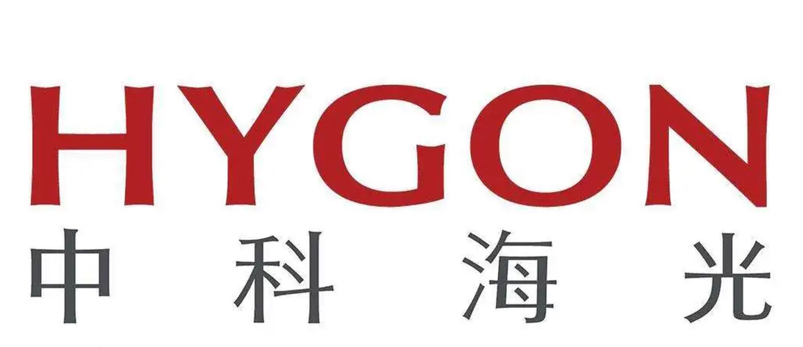

**成都，2025 年 12 月 15 日** —— 成都破晓石科技有限公司（以下简称“破晓石”）宣布与海光完成 **CPU 与 DCU（数据中心加速单元）芯片** 的兼容性认证与联合验证。双方围绕国产异构算力在生产环境的可部署性与可运维性开展测试，覆盖操作系统与驱动、容器化、AI模型训练与推理等关键环节。

|  |  |
| --- | --- |
|  |  |

在 AI 训推、科学计算与行业智能化加速等场景中，CPU 与加速芯片的协同效率与稳定性，直接影响平台交付周期与运行风险。本次兼容性认证旨在通过标准化测试与联合调优，验证软硬件栈在真实业务负载下的互操作能力，为下游客户提供更清晰的选型与交付依据。

## 认证范围与验证要点

- **系统与驱动适配**：验证操作系统环境下的驱动加载、设备识别、资源分配、日志与告警等基础能力，确保可安装、可运行、可排障。
- **容器与编排场景**：在容器化与编排调度场景下验证设备的可用性与隔离策略，覆盖典型的资源调度与运行时配置流程。
- **AI 训推场景适配**：在 AI 大模型训练和推理的场景下，晓石 AI 智算平台充分利用底层算力设备，最大化发挥了平台的调度能力和芯片硬件性能。

## 认证价值：让国产异构算力更易交付、更可规模化

通过本次兼容性认证，破晓石将把已验证的软件栈与交付经验沉淀为可复用的部署模板与联调方法，降低从 PoC 到生产的迁移成本，帮助行业客户更快构建可控、可持续迭代的智算底座。

海光产业生态合作组织（光合组织）长期围绕国产通用计算平台联合产业链上下游，推动产品适配、兼容性测试与生态共建。破晓石将持续与生态伙伴推进适配与联合优化工作，面向云原生与 AI 智算场景完善平台化能力，为更多行业应用提供稳定可靠的基础设施支撑。

破晓石负责人马青表示：“兼容性认证不是一次性的结论，而是可持续演进的工程体系。我们希望通过与生态伙伴的联合验证，把国产异构算力从‘可用’推进到‘好用、易交付、可规模化’。”

## 赋能各行业 AI 创新，加速国产化进程

结合本次适配与认证成果，破晓石将把对国产 CPU 与 DCU 的适配经验融入到云原生与智算平台交付体系中，面向电信、能源、教育等对稳定性与合规要求更高的行业场景，提供更高效、可控的算力管理与调度能力，助力客户加速完成国产化替代与业务创新。

破晓石在智算平台交付中重点提供以下能力，帮助客户把“能用的国产算力”变成“可规模化运营的算力服务”：

- **资源池化与统一管理**：对多类型加速卡资源进行统一纳管与池化管理，支持按集群/项目/租户进行资源归集与统计。
- **按需调度与智能分配**：提供面向任务的资源调度与配额机制，支持优先级与队列管理，提升异构环境下的资源利用效率。
- **简化运维与稳定性提升**：提供设备状态监控、日志与告警联动、故障定位辅助等能力，形成标准化运维流程，提升平台可用性。
- **成本与效率优化**：通过细粒度资源分配与弹性策略，减少资源闲置与等待时间，帮助客户在保障体验的同时降低综合拥有成本（TCO）。
- **多租户隔离与安全保障**：在容器与租户边界上提供资源隔离与权限控制，满足关键行业对资源安全与合规的要求。
- **支持 AI 训练与推理全流程**：面向训推一体化场景提供从资源准备、任务运行到服务化部署的统一支撑，缩短模型从研发到落地的周期。

## 展望未来：共建国产 AI 算力生态

未来，破晓石将与海光及更多生态伙伴持续推进技术融合与联合优化，围绕国产异构算力在云原生、AI 训推、高性能计算等方向沉淀更多可复用的适配清单与交付实践，为更多行业的数字化转型提供稳定、可持续演进的算力底座。

