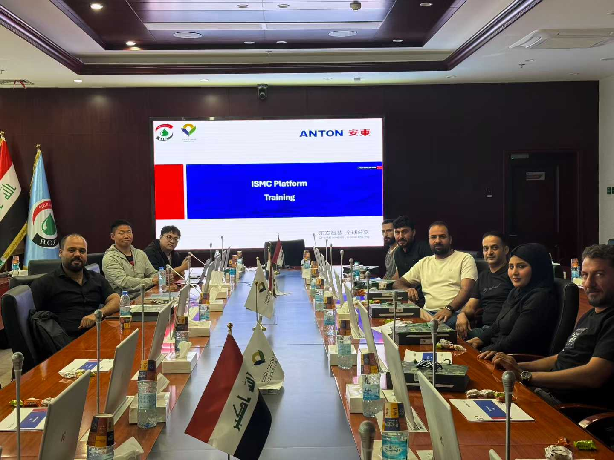

7月24日，晓石云在巴士拉与马基努油田运营方正式完成最终验收，标志着该油田从传统离线生产调度全面升级为云原生智能平台。项目团队在短短六个月内完成了基础设施搭建、应用迁移与业务流程再造，最终通过三轮联合演练验证，实现生产、维护、供应链和管理决策的协同闭环。

## 项目背景

马基努油田位于伊拉克南部，是当地最重要的陆上油田之一，拥有跨越 120 公里的油气管网和数百座油井站。由于长期采用分散式 IT 系统，信息孤岛严重、设备状态不可视、跨部门协同效率低。2024 年底，客户与晓石云签署战略合作，希望借助云计算PaaS平台重塑数据中心资源交付能力，并建立覆盖 24/7 的远程运维体系。

## 技术亮点

1. **混合云底座**：在马基努本地部署集群，并与华为云和Vmware vCenter打通，实现一个中心管控多套基础设施，同时具备云端弹性算力。
2. **油田应用市场**：针对油田 IT 信息系统发布专属和私有的应用SaaS服务市场，除了满足马基努自身 IT 信息化建设外，也具备对外能力输出。
4. **AI能力**：通过AI智算平台集中化管理数据中心 GPU 算力和模型服务的资源，从传统的资源分配模式过渡到 API Token分配

## 客户价值

- **统一弹性算力**：混合云底座将本地集群与私有云统一纳管，关键勘探与排采应用在峰值时可自动伸缩，算力利用率提升 38%。
- **业务上线提速**：油田应用市场提供“即开即用”的地质、财务、物资等模块，应用交付周期从数周 周缩短至10 分钟，IT 团队可为合作方输出同一套 SaaS 服务。

## 后续计划

2026 年，双方将把混合云底座与应用市场复制到其他油田，形成“区域级能源云”统一管理模型。同时，AI 能力中心将引入碳排放、绿色能源调度等模型，构建端到端的数字孪生指挥体系。后续，晓石云会与马基努油田展开更深层次合作，助力其打造覆盖研发、生产、供应链的联合运营指挥中心，并培养本地数字化人才，确保项目价值持续释放。